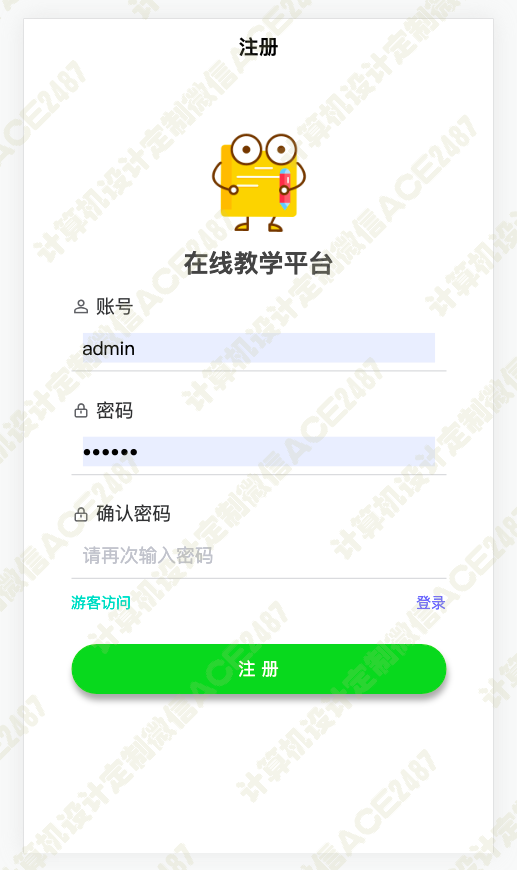

# 020 基于uniapp的在线课程教学系统-设计源码展示

> **代码有偿获取 可接受定制 微信联系方式: csbysj2020 或 ACE2487，备注(BS)**

> 

> 

## 介绍

UniApp是一款使用Vue.js开发所有前端应用的框架，能够同时在iOS、Android、H5、小程序等多个平台上运行；所以本系统可以是一个安卓app，也可以是微信小程序

系统包括以下功能：

课程查询 课程详情 课程介绍 课程目录 我的钱包 个人中心 已购课程 课程测验 修改密码 修改个人信息 课程分类筛选 后台管理

## 技术栈

python django vue uniapp 安卓app 微信小程序 网页H5 uview 课程查询 课程详情 课程介绍 课程目录 我的钱包 个人中心 已购课程 课程测验 修改密码 修改个人信息 课程分类筛选 后台管理

## 视频

> **点击查看 \>\>\> [https://www.bilibili.com/video/BV17b411Z7mx/](https://www.bilibili.com/video/BV17b411Z7mx/)**

## 截图

